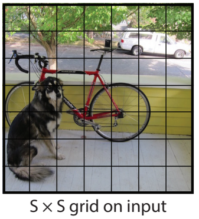
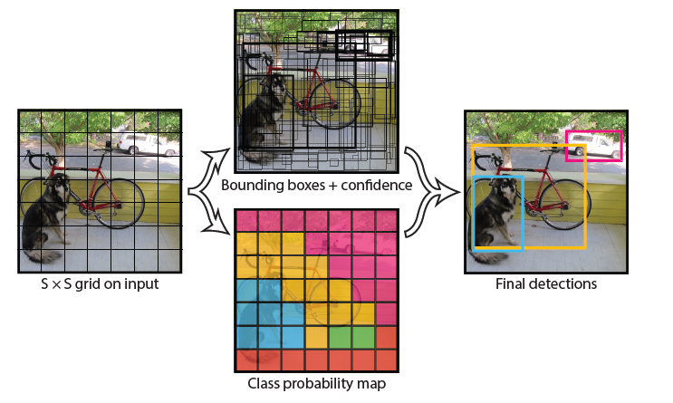
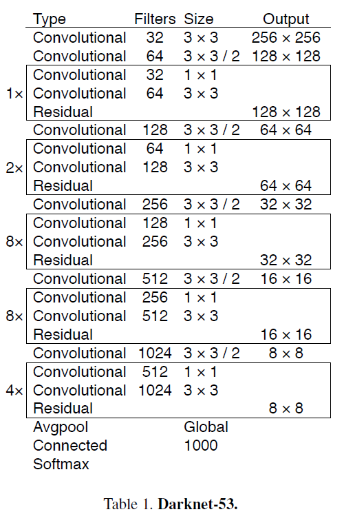

# Yolov3说明文档

[Yolov3](https://arxiv.org/abs/1804.02767)

## 介绍

Yolo方法是目标检测的常用算法，是一种典型的one-stage检测方法。比起two-stage的方法，one-stage的Yolo方法少了一次卷积获得proposal的过程，直接从图像中用一个卷积神经网络得出预测结果。特点是快而且精确度较高，略低于two-stage方法。Yolo的全称是you only look once，意为只检测一次，与其只有一个卷积网络吻合。是一种兼顾速度与准确率的方法。

## 特点：end-to-end

end-to-end的意思是，输入是最原始的数据，输出是想要得到的结果，不需要额外对数据集进行处理，也不需要对结果再进行加工。特征的提取，训练都在算法内部。
这使得yolo网络目标明确，方便使用。

## 特点：回归问题

Yolo中的检测是一个回归问题，把受检测图片划分为$S \cdot S$个格子，然后对于每一个格子，预测五个值，(x,y,w,h,confidence)。



* x,y 分别为boundingbox的中心坐标（相对于本格子）
* w,h 分别为boundingbox的宽度和高度
* confidence 为置信度，计算为$confidence = P \cdot IOU$,P为groundtruth是否在本格子里，是为1，否为0；IOU为预测的boundingbox与实际groundtruth的交集比上并集的比值。

生成的时候要对每个格子生成$2 \cdot boundingbox + classes$数量的预测值。总共就是$(S \cdot S \cdot (2 \cdot B + C))$个值。
一个总的流程大意图如下：



以上原理是Yolov1的原理和思想，v3与其基本思想一致，网络结构上有一些差异，v3的网络结构如下图:



其网络结构有53个卷积层。

## 优点

* 只进行一次检测，速度较快
* 输入输出为原图片和检测结果，便于使用
* 精确度较高

## 适用领域

稍微大型的目标检测问题

## 参考文献

```bibtex
@inproceedings{redmon2016you,
  title={You only look once: Unified, real-time object detection},
  author={Redmon, Joseph and Divvala, Santosh and Girshick, Ross and Farhadi, Ali},
  booktitle={Proceedings of the IEEE conference on computer vision and pattern recognition},
  pages={779--788},
  year={2016}
}
@article{redmon2018yolov3,
  title={Yolov3: An incremental improvement},
  author={Redmon, Joseph and Farhadi, Ali},
  journal={arXiv preprint arXiv:1804.02767},
  year={2018}
}
```