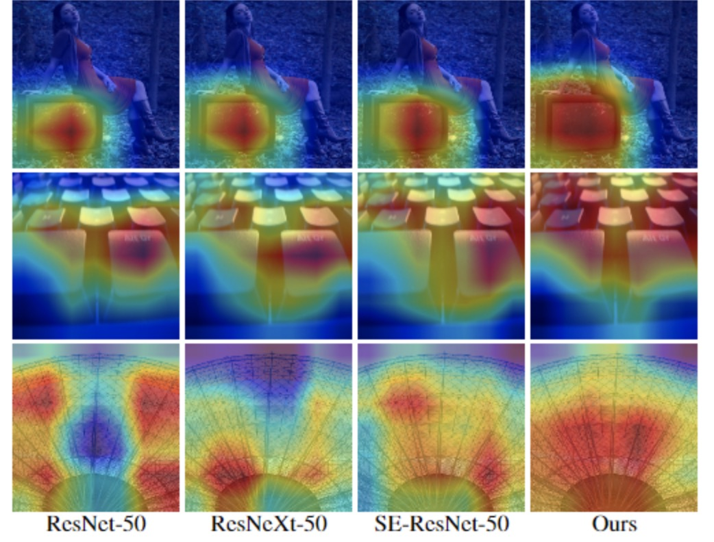
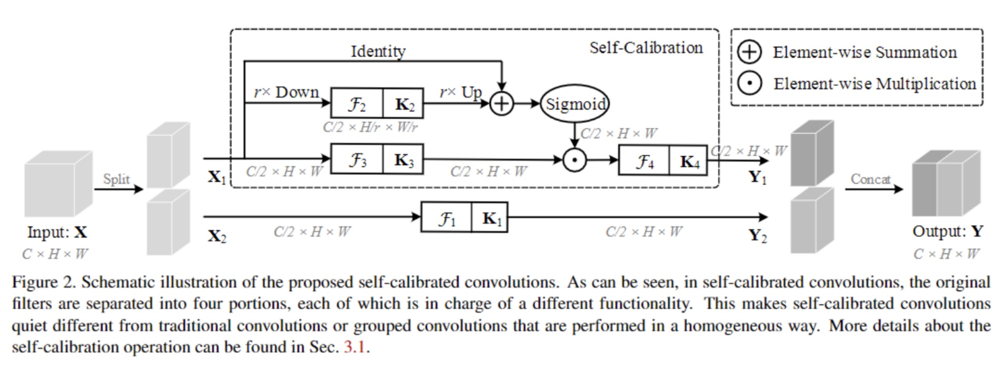

# HrNet说明文档

> [SCNet](http://mftp.mmcheng.net/Papers/20cvprSCNet.pdf)

## 简介
考虑在不调整模型架构的情况下改进CNN的基本卷积特征转换过程。为此，它提出了一种新颖的自校正卷积，该卷积它可以通过特征的内在通信达到扩增卷积感受野的目的，进而增强输出特征的多样性。不同于标准卷积采用小尺寸核（例如3×3卷积）同时融合空间维度域与通道维度的信息，SCNet所设计的SCConv可以通过自校正操作自适应地在每个空间位置周围建立了远程空间和通道间依存关系。因此，它可以帮助CNN生成更具判别能力的特征表达，因其具有更丰富的信息。


## 特点：小尺寸核+附近区域的信息和通道上的交互信息

1.结构设计：Alext-VGG-GoogleNet-ResNet-DenseNet-ResNeXt-NasNet
2.长距离依赖建模（注意力机制）：SENet-GENet-CBAM-GCNet-GALA-AA-NLNet
没有设计复杂的网络体系结构来增强特征表示，而是引入了自校正卷积作为一种有效的方法来帮助卷积网络通过增加每层的基本卷积变换来学习判别表示。类似于分组卷积，它将特定层的卷积核分为多个部分，但不均匀地每个部分中的卷积核以异构方式被利用。具体而言，自校正卷积不是通过均匀地对原始空间中的输入执行所有卷积，而是首先通过下采样将输入转换为低维嵌入。采用由一个卷积核变换的低维嵌入来校准另一部分中卷积核的卷积变换。得益于这种异构卷积和卷积核间通信，可以有效地扩大每个空间位置的感受野。


作为标准卷积的增强版本，自校正卷积具有两个优点，空间上的每一个点都有附近区域的信息和通道上的交互信息，同时也避免了整个全局信息中无关区域的干扰，具体来说：

* 首先，它使每个空间位置都能自适应地编码远距离区域的信息上下文，从而打破了在小区域（例如3x3）内进行卷积的传统。 这使自校正卷积产生的特征表示更具辨识性。将ResNet生成的具有不同类型卷积的特征激活图可视化，可以看出，具有自校正卷积的ResNet可以更准确和整体地定位目标对象，并且采用SCNet的输出对前景有明显的分割。

* 其次，提出的自校正卷积是通用的，可以轻松应用于标准卷积层，而无需引入任何参数和复杂性开销或更改超参数。




## 优点

- 设计简单且通用，可以轻松增强标准卷积层的性能，而不会引入额外的参数和复杂性。

- 空间上的每一个点都有附近区域的信息和通道上的交互信息，同时也避免了整个全局信息中无关区域的干扰

## 适用领域

主要适用于姿态估计，也可以用于分割，分类任务。


## 参考文献
```
@inproceedings{sun2019deep,
  title={Deep high-resolution representation learning for human pose estimation},
  author={Sun, Ke and Xiao, Bin and Liu, Dong and Wang, Jingdong},
  booktitle={Proceedings of the IEEE/CVF Conference on Computer Vision and Pattern Recognition},
  pages={5693--5703},
  year={2019}
}
```

